# Endless Waves Survival

<p align="center">
  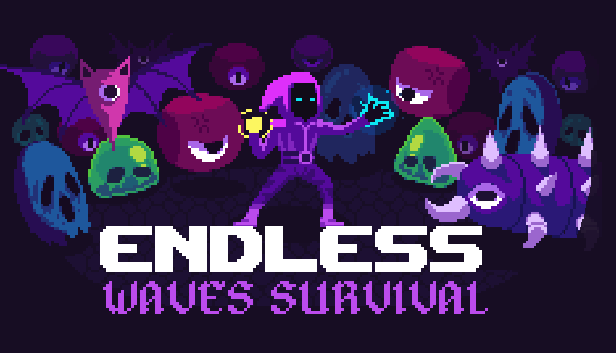
</p>

A survival game about fighting an endless wave of enemies. You level up, grab
upgrades and see how long you can last.

Built with Godot 3.5.

## Preview

### Trailer

[▶ Watch the trailer on YouTube](https://www.youtube.com/watch?v=07mUyXSm8_w)

### Screenshots

<table>
  <tr>
    <td>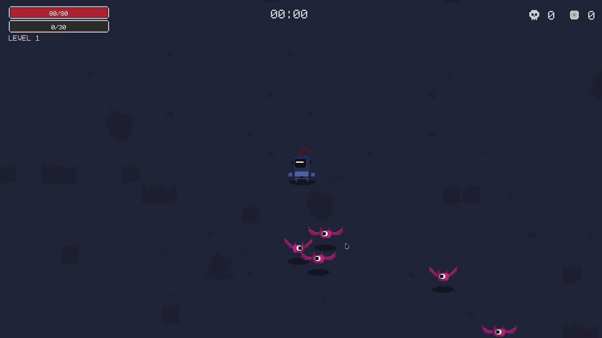</td>
    <td>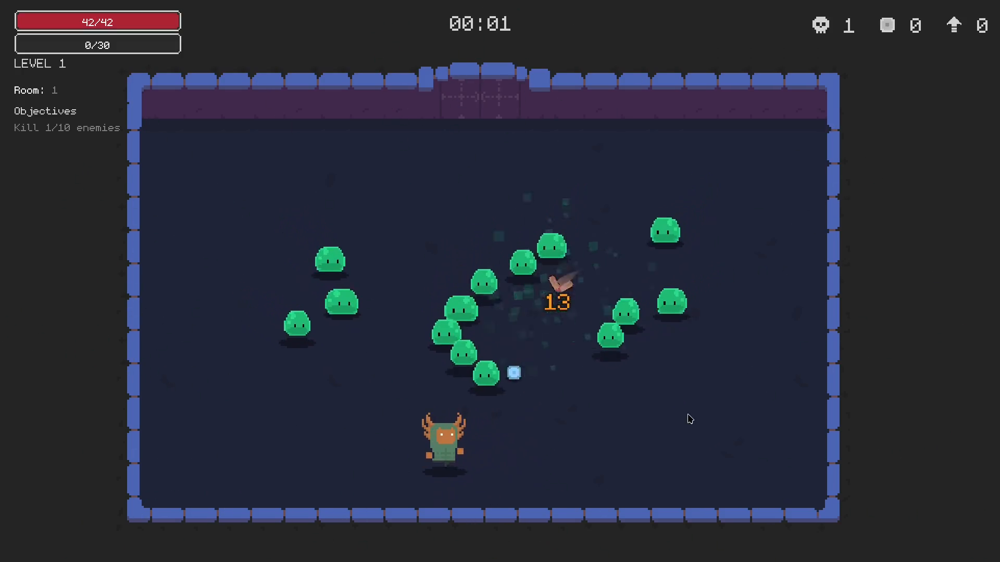</td>
    <td>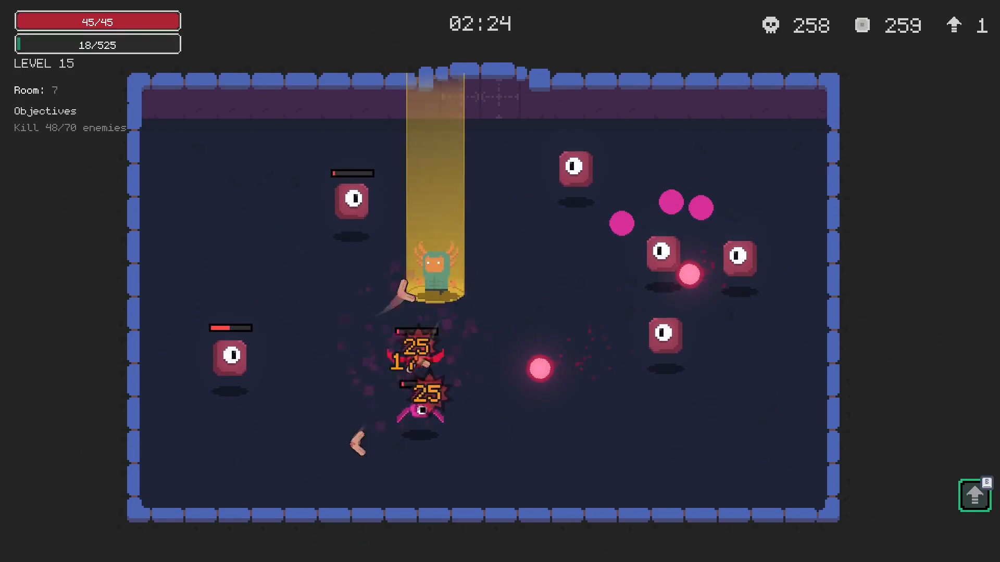</td>
  </tr>
  <tr>
    <td>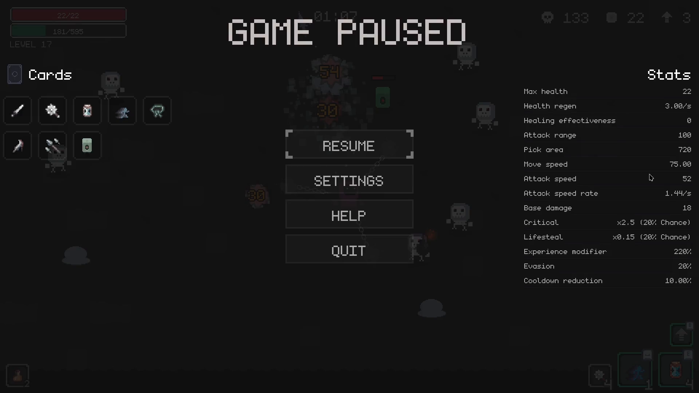</td>
    <td>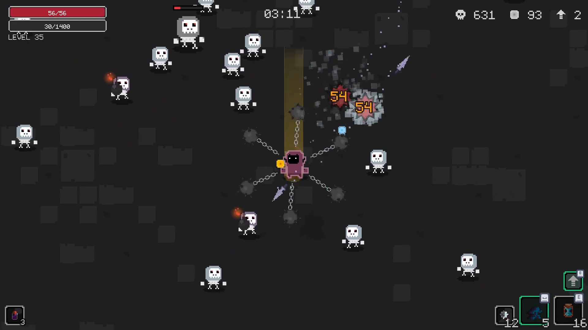</td>
    <td>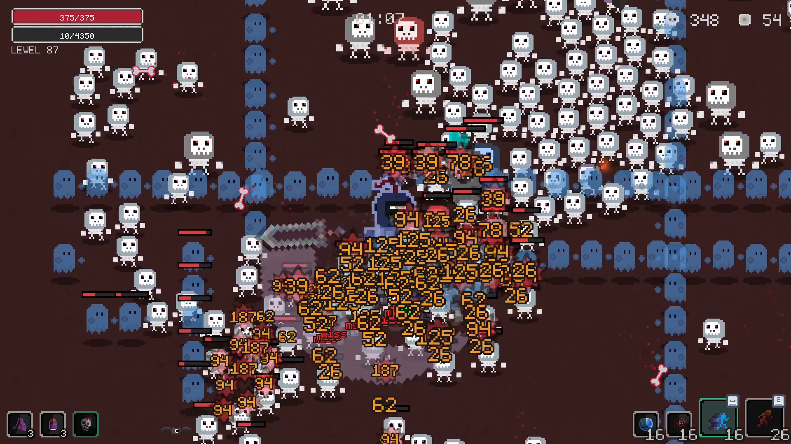</td>
  </tr>
  <tr>
    <td>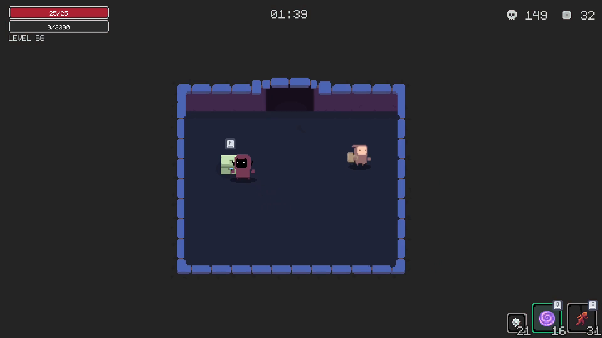</td>
    <td>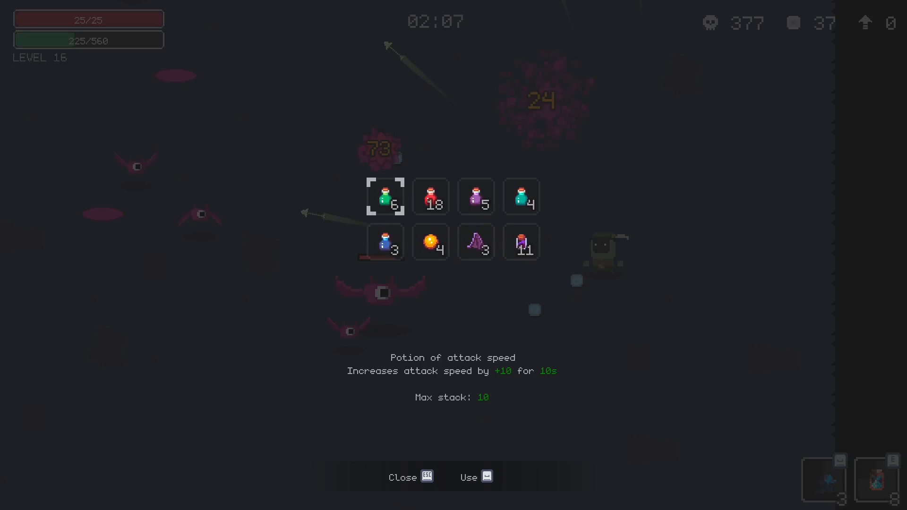</td>
    <td>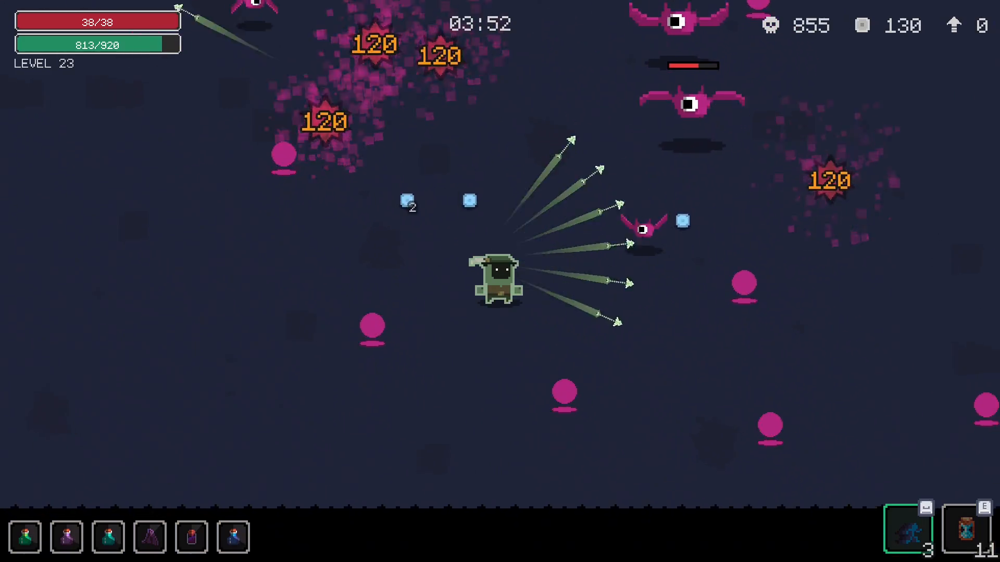</td>
  </tr>
  <tr>
    <td>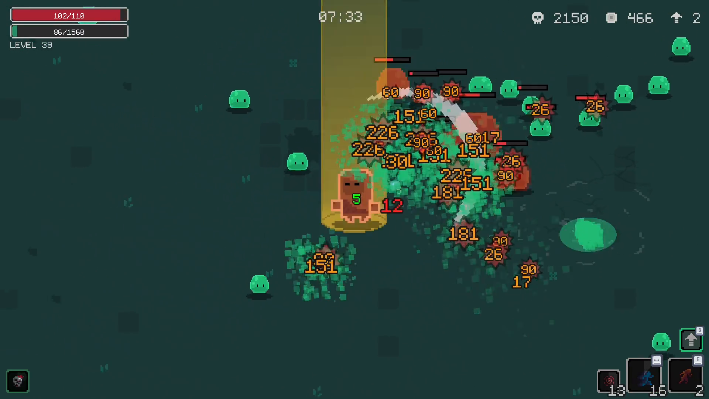</td>
    <td>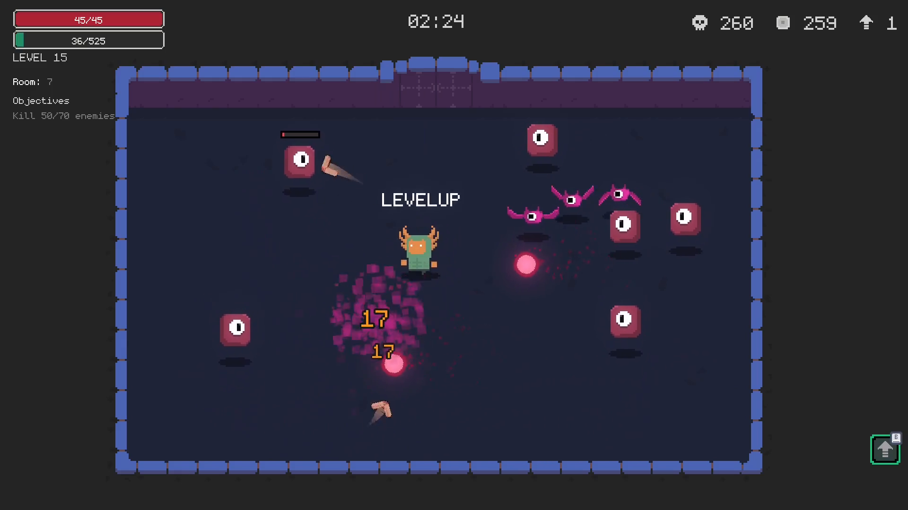</td>
    <td>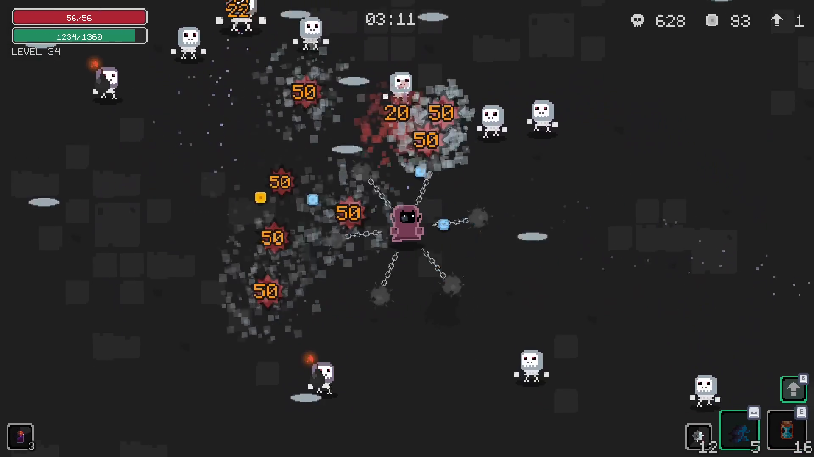</td>
  </tr>
  <tr>
    <td>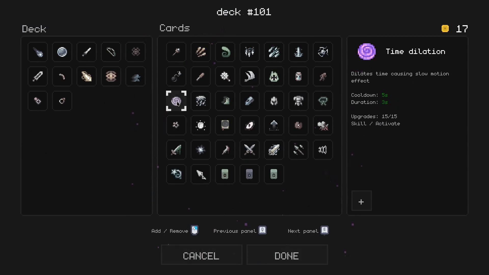</td>
    <td>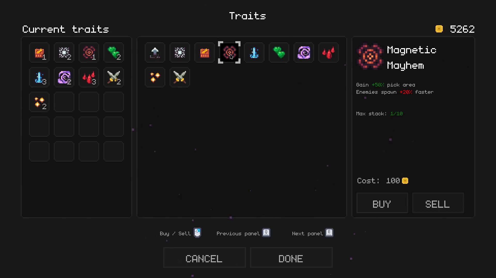</td>
    <td>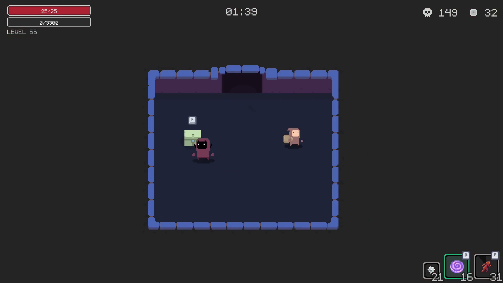</td>
  </tr>
</table>

## Where to play

[](https://store.steampowered.com/app/1989560/)
[](https://play.google.com/store/apps/details?id=org.jefersonbelmiro.rapture)
[](https://jefersonbelmiro.itch.io/endless-waves-survival)
[](https://www.crazygames.com/game/endless-waves-survival)
[](https://apps.apple.com/app/endless-waves-survival/id1624568956)

The iOS version is discontinued. I didn't renew the Apple Developer subscription.

## Why I open sourced this

A few people asked me to open source the game, so here it is. Honestly, I just
lost the motivation to keep working on it. What I want now is for the people
who liked it to be able to keep it going.

There are still a few things I haven't figured out, and I'd love some input:

- Name and branding. Should this be published as a separate Community Edition,
  or keep the same name on the platforms where the game is already live, so
  people who already own it keep their progress?
- Paid vs free. Google Play and itch.io are already free. Steam can be switched
  to free. CrazyGames is ad supported, and there is no way for me, as the owner,
  to not earn from it. I'm open to suggestions here.

At the end of the day I just want to keep the game alive for anyone who cares
about it, and maybe have it work as a study on how it was built. There is a lot
I would have done differently. Mostly because I didn't have the time, and
honestly I didn't have the knowledge either.

## Table of contents

- [Preview](#preview)
- [Features](#features)
- [Getting started](#getting-started)
  - [Requirements](#requirements)
  - [Running in the editor](#running-in-the-editor)
- [Configuration](#configuration)
  - [Online leaderboard (Firebase)](#online-leaderboard-firebase)
  - [Export presets](#export-presets)
- [Project structure](#project-structure)
- [Audio](#audio)
- [Controls](#controls)
- [Contributing](#contributing)
- [Credits](#credits)
- [License](#license)

## Features

- A few playable characters, each with its own passives and playstyle.
- A deck system. You build and edit a card deck for each character.
- Lots of cards, consumables and traits to mix each run.
- Several maps with different mechanics.
- Local and online leaderboards.
- Steam integration (achievements, leaderboards, cloud save).
- Localization in English, Portuguese and Chinese.

## Getting started

### Requirements

- Godot 3.5.3. [Download here](https://godotengine.org/download/archive/3.5.3-stable/).

### Running in the editor

1. Clone the repository.
2. Open the project in Godot 3.5.3.
3. Press F5 (or the Run Project button).

That's all. The game runs in the editor without any extra setup. The online
leaderboard is optional and off by default. See
[Configuration](#configuration) to turn it on.

## Configuration

Sensitive and optional settings are kept out of git. Copy the example files and
fill in your own values when you need them.

### Online leaderboard (Firebase)

The online leaderboard uses Firebase. Copy the example and fill in your
project's values:

```sh
cp firebase.json.example firebase.json
```

`firebase.json`:

```json
{
  "api_key": "your-firebase-api-key",
  "firebase_url": "https://your-project-default-rtdb.firebaseio.com/"
}
```

Don't commit this file. It's gitignored.

### Export presets

Export presets are different for every machine and can hold secrets like
keystores and signing passwords, so `export_presets.cfg` is gitignored. To set
up your own presets, configure them in the Godot editor or copy the scrubbed
template:

```sh
cp export_presets.cfg.example export_presets.cfg
```

Replace the `__PLACEHOLDER__` values with your own credentials.

## Project structure

```
src/                 Game source code (scenes, scripts, data)
src/autoload/        Autoloaded singletons (settings, global state, firebase, ...)
src/chars/           Playable characters
src/spells/          Cards (autocast, passive, summon, ultimate)
src/enemies/         Enemies and bosses
src/maps/            Maps
src/screens/         UI screens (menu, settings, scoreboard, ...)
assets/              Art, audio and effects
addons/steam_api/    Third-party Steam integration (MIT)
publish/store/icons/ App icons
publish/store/steam/    Store capsules and logos
publish/store/screenshots/ Store screenshots
```

## Audio

The original music and sound effects were removed for licensing reasons. The
shipped `.wav` files are silent placeholders that keep the same filenames, so
the game runs fine but has no sound.

To add your own audio:

- Replace the placeholder `.wav` files (keeping the same names), or update the
  paths in `src/autoload/sfx.gd` (SFX) and
  `src/components/music_player/music_player.gd` (music playlist).
- SFX live in `assets/sfx/effects/` (plus spell/effect files under
  `src/spells/**/sfx/`, `src/env/**/sfx/` and `src/popup/**/`).
- Music lives in `assets/sfx/musics/` (and `assets/sfx/musics/playlist/`); each
  track has `start_offset`/`loop_offset` in `music_player.gd`.
- The `SFX` and `Music` buses are defined in `default_bus_layout.tres`.

See [THIRD_PARTY_NOTICES.md](THIRD_PARTY_NOTICES.md) for the original sources
and licenses (some were CC0 and are safe to re-download).

## Controls

| Action        | Keyboard     |
| ------------- | ------------ |
| Move          | WASD / arrows |
| Dash          | Space        |
| Ultimate 0    | Q            |
| Ultimate 1    | E            |
| Open upgrades | B            |
| Open backpack | R            |
| Interact      | F            |
| Pause         | P / Esc      |

## Contributing

Contributions are welcome. Read [CONTRIBUTING.md](CONTRIBUTING.md) and the
[Code of Conduct](CODE_OF_CONDUCT.md) before opening a pull request.

## Credits

- Game by Jeferson Belmiro.
- Icons by [Clockwork Raven](https://clockworkraven.itch.io/raven-fantasy-icons)
  (Raven Fantasy Icons).
- Main menu background and store logos by
  [Inkpendude](https://inkpendude.carrd.co).
- Main menu music by ComposerOfEmotions.
- Steam integration via
  [godot-steam-api](https://github.com/samsface/godot-steam-api) by Sam Murray
  (MIT).
- Icons and art have their own licenses. See
  [THIRD_PARTY_NOTICES.md](THIRD_PARTY_NOTICES.md) for full audio and art
  attribution, details and links.

## License

The code is licensed under the [MIT License](LICENSE).

Audio and art assets are not covered by that license. See
[THIRD_PARTY_NOTICES.md](THIRD_PARTY_NOTICES.md) for details.

The shipped audio files are silent placeholders; see [Audio](#audio) to add
your own sound.
